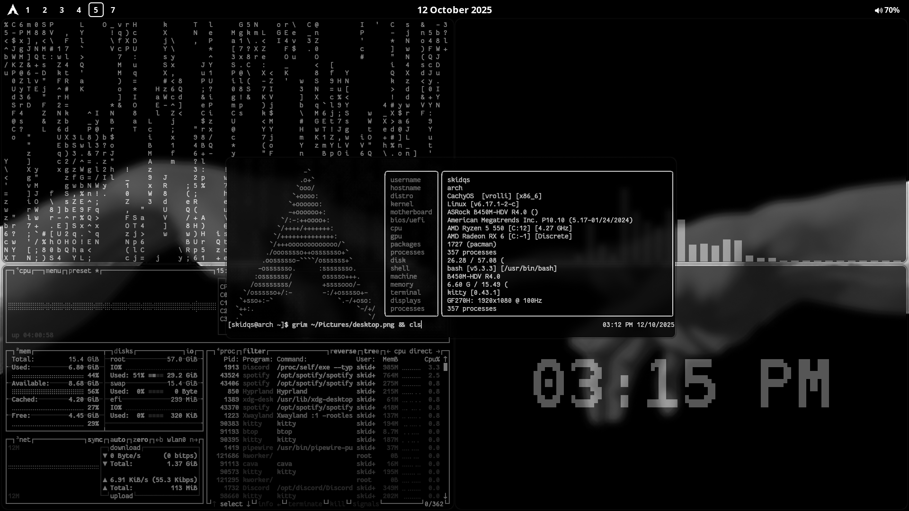

<div align="center">
    <h1> skidqs hyprland dotfiles </h1>
    <h3></h3>
</div>

<div align="center"> 


<a href="https://discord.gg/GtdRBXgMwq">  </a>

Welcome to my Hyprland dot files this repository contains my configuration files for a sleek, modern, and functional Hyprland desktop environment with a Wlogout power menu, a custom Rofi app launcher, and a semi-transparent Kitty terminal.

## Screenshots


## Features
- **Hyprland**: Dynamic tiling with Dwindle layout, smooth animations, and French keyboard support
- **Waybar**: Custom top bar with workspaces, clock,
- **Hyprlock**: Elegant lock screen with time, date, music info, and battery status
- **Hyprpaper**: Wallpaper management with Pywal integration
- **Hypridle**: Idle management with screen lock and DPMS control
- **Wlogout**: Stylish power menu for lock, logout, suspend, hibernate, reboot, and shutdown
- **Rofi**: Minimalist app launcher with a dark theme and rounded corners
- **Kitty**: Terminal with a semi-transparent background
- **Custom Keybindings**: Super key-based controls for workspaces, windows, screenshots, and media

## Cursor Theme
This configuration uses the [Bibata cursor theme](https://aur.archlinux.org/packages/bibata-cursor-theme)

To install Bibata on Arch-based operating systems run this:
```bash yay -S bibata-cursor-theme```


## Dependencies
- Hyprland
- Waybar
- Hyprpaper
- Hyprlock
- Hypridle
- Swaync
- Wlogout
- Rofi
- Kitty
- Dolphin (file manager)
- NetworkManager (network)
- Yay (AUR helper for updates)
- Fira Sans (Wlogout font)
- JetBrains Mono (Hyprlock font)
- Font Awesome 6 Free (icons)

## Keybindings

- Super + Return: Launch Kitty terminal
- Super + D: Open Rofi app launcher
- Super + Q: Close active window
- Super + Space: Toggle floating window
- Super + 1-0: Switch to workspace 1-10
- Super + G: Toggle groups

## Directorys

```
skidqs/
│
├── .bashrc/
│    └── .bashrc
│
├── .config/
│   ├── hypr/
│   │   ├── Monitor_Profiles/
│   │   │   └── default.conf
│   │   │
│   │   ├── UserConfigs/
│   │   │   ├── 01-UserDefaults.conf
│   │   │   ├── ENVariables.conf
│   │   │   ├── Startup_Apps.conf
│   │   │   ├── UserAnimations.conf
│   │   │   ├── UserDecorations.conf
│   │   │   ├── UserKeybinds.conf
│   │   │   ├── UserSettings.conf
│   │   │   └── WindowRules.conf
│   │   │
│   │   ├── UserScripts/
│   │   │   ├── Tak0-Autodispatch.sh
│   │   │   ├── WallpaperEffects.sh
│   │   │   ├── WallpaperSelect.sh
│   │   │   ├── Weather.sh
│   │   │   └── weather.py
│   │   │
│   │   ├── animations/
│   │   │   ├── 00-default.conf
│   │   │   ├── 03- Disable Amation.conf
│   │   │   ├── END-4.conf
│   │   │   ├── HYDE - Vertical.conf
│   │   │   ├── HYDE - default.conf
│   │   │   ├── HYDE - minimal-1.conf
│   │   │   ├── HYDE - minimal-2.conf
│   │   │   ├── HYDE - optimized.conf
│   │   │   ├── ML4W - classic.conf
│   │   │   ├── ML4W - dynamic.conf
│   │   │   ├── ML4W - fast.conf
│   │   │   ├── ML4W - high.conf
│   │   │   ├── ML4W - moving.conf
│   │   │   ├── ML4W - standard.conf
│   │   │   ├── Mahaveer - me-1.conf
│   │   │   └── Mahaveer - me-2.conf
│   │   │
│   │   ├── configs/
│   │   │   └── keybinds.conf
│   │   │
│   │   ├── scripts/
│   │   │   ├── Animations.sh
│   │   │   ├── Brightness.sh
│   │   │   ├── BrightnessKbd.sh
│   │   │   ├── ChangeBlur.sh
│   │   │   ├── ChangeLayout.sh
│   │   │   ├── DarkLight.sh
│   │   │   ├── Distro_update.sh
│   │   │   ├── Dropterminal.sh
│   │   │   ├── GameMode.sh
│   │   │   ├── Hypridle.sh
│   │   │   ├── KeyBinds.sh
│   │   │   ├── KillActiveProcess.sh
│   │   │   ├── Kitty_themes.sh
│   │   │   ├── LockScreen.sh
│   │   │   ├── MediaCtrl.sh
│   │   │   ├── MonitorProfiles.sh
│   │   │   ├── PortalHyprland.sh
│   │   │   ├── Refresh.sh
│   │   │   ├── RefreshNoWybar.sh
│   │   │   ├── Sounds.sh
│   │   │   ├── SwitchKeyboardLayout.sh
│   │   │   ├── Tak0-Autodispatch.sh
│   │   │   ├── Tak0-Per-Window-Switch.sh
│   │   │   ├── Volume.sh
│   │   │   ├── WallustSwww.sh
│   │   │   ├── WaybarCava.sh
│   │   │   ├── WaybarLayout.sh
│   │   │   ├── WaybarSCripts.sh
│   │   │   ├── WaybarStyles.sh
│   │   │   ├── Wlogout.sh
│   │   │   └── sddm_wallpaper.sh
│   │   │
│   │   ├── wallust/
│   │   │   └── wallust-hyprland.conf
│   │   │
│   │   ├── application-style.conf
│   │   ├── hypridle.conf
│   │   ├── hyprland.conf
│   │   ├── hyprlock.conf
│   │   ├── initial-boot.sh
│   │   └── monitors.conf
│   │
│   ├── waybar/
│   │   ├── wallust/
│   │   │   └── color-waybar.css
│   │   │
│   │   ├── scripts/
│   │   │   └── volume.sh
│   │   │
│   │   ├── config.json
│   │   └── style.css
│   │
│   ├── wlogout/
│   │   ├── icons/
│   │   │   ├── hibernate.png
│   │   │   ├── lock.png
│   │   │   ├── logout.png
│   │   │   ├── reboot.png
│   │   │   ├── shutdown.png
│   │   │   └── suspend.png
│   │   │
│   │   ├── layout.json 
│   │   ├── style.css
│   │   └── theme.css
│   │
│   ├── rofi/
│   │   ├── themes
│   │   │   └── skidqs.theme.rasi
│   │   │
│   │   ├── wallpapers
│   │   │   └── currently no wallpapers
│   │   │
│   │   ├── config-wallpaper.rasi
│   │   └── config.rasi
│   │
│   ├── swaync/
│   │   ├── config.json
│   │   └── style.css
│   │
│   ├── kitty/
│   │   └── kitty.conf
│   │
│   ├── cava/
│   │   ├── shaders/
│   │   │   ├── bar_spectrum.frag
│   │   │   ├── eye_of_phi.frag
│   │   │   ├── normalized_bars.frag
│   │   │   ├── northern_lights.frag
│   │   │   ├── pass_through.vert
│   │   │   ├── spectrogram.frag
│   │   │   └── winamp_line_style_spectrum.frag
│   │   │
│   │   ├── themes/
│   │   │   ├── solarized_dark
│   │   │   └── tricolor
│   │   │
│   │   └── config
│   │
│   ├── fastfetch/
│   │   ├── config.jsonc
│   │   ├── config.toml
│   │   └── logo.txt
│   │
│   ├── btop/
│   │   └── btop.conf
│   │
│   ├── bigclock/
│   │   ├── requierments.txt
│   │   └── bigclock.sh
│   │
│   └── vencord/
│       └── settings.json
│
├── screenshots/
│   └── desktop.png
│
├── README.md
└── LICENSE
```
